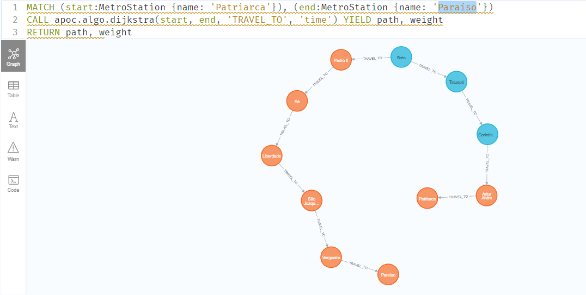

# API de viagem pelo Metrô de SP

## Objetivo
 Essa API construída utilizando o NestJs, tem como objetivo através da Teoria dos grafos junto com o algoritmo de dijkstra, achar o menor trajeto de viagem utilizando o Metrô de SP.

 ## Tecnologias
 - NestJs / Typescript
 - Neo4j
 - Jest

 ## POC
## Mapeamento da rede do metrô:

## Melhor trajeto entre a estação Patriarca - linha vermelha até a estação Paraíso - linha azul

